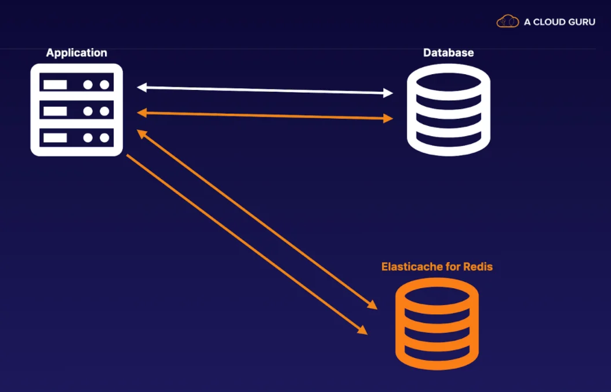
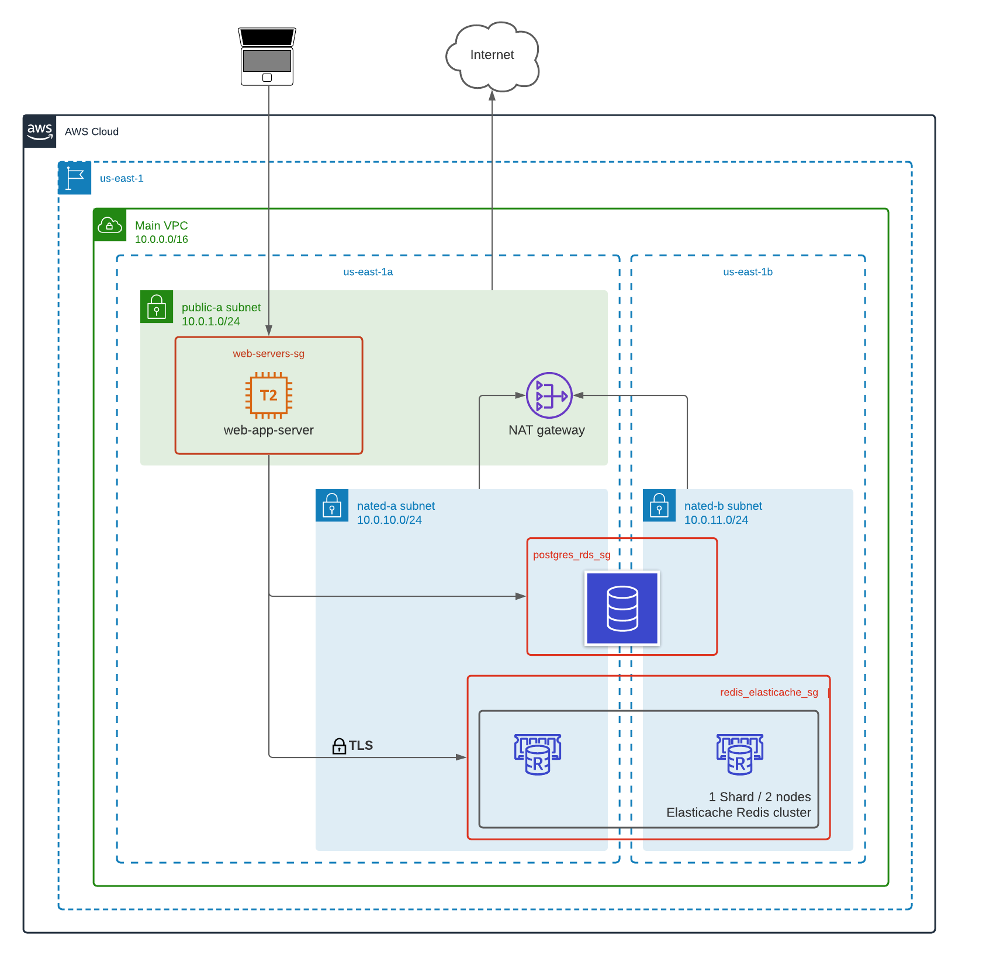
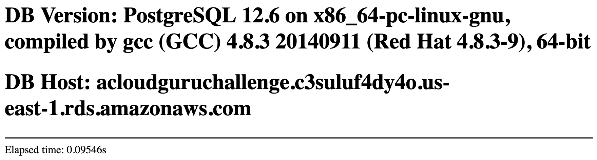

+++
title = 'AWS Elasticache - A Cloud Guru Challenge'
date = 2021-07-30T20:00:00-06:00
description = "AWS Elasticache from A Cloud Guru July 2021"
tags = ["challenge", "acloudguru", "aws", "elasticache"]
draft = false
+++

## El reto
This challenge consists of deploying a simple Python application on an EC2 instance and RDS PostgreSQL database instance, and then optimize the performance of the application caching database queries using an [ElastiCache Redis cluster](https://aws.amazon.com/elasticache/).

 [Github repo](https://github.com/ArcezD/elastic-cache-challenge)

## My approach
I decided to make the deployment of all the resources using Terraform, for those who don't know, it’s a powerful tool to implement Infrastructure as a Code.
I also decided to package the Python application as a Docker container.

## Architecture diagram
<!--<div className="Image__Small">
  
</div>-->


## Terraform scripts

#### variables.tf
I have created some variables at the terraform scripts to make it easier to change some of the resources attributes like the name of the resources, instance sizes, and custom tags

|Variable |Description  | Default value|
--- | --- | ---
|region|AWS region|us-east-1|
|ec2_key_name|AWS EC2 key pair name|
|ec2_instance_name|AWS EC2 instance name|
|ec2_instance_type|AWS EC2 instance type|t2.micro|
|rds_instance_identifier|AWS rds instance identifier|
|rds_instance_db_instance_class|AWS rds instance class|db.t2.micro|
|rds_instance_db_name|AWS rds instance db name|
|rds_instance_db_username|AWS rds instance db username|
|redis_cluster_name|AWS Elasticache redis cluster name|
|redis_cluster_node_type|AWS Elasticache redis cluster node type|cache.t2.micro|
|sql_initial_script_url|SQL Initial script url to be executed at init-data
|tags|AWS resources tags|

```hcl
variable "region" {
  description = "AWS region"
  default     = "us-east-1"
  type        = string
}

variable "ec2_instance_name" {
  description = "AWS EC2 instance name"
  type        = string
}
variable "ec2_instance_type" {
  description = "AWS EC2 instance type"
  type        = string
  default = "t2.micro"
}

variable "ec2_key_name" {
  description = "AWS EC2 key pair name"
  type        = string
}

variable "rds_instance_identifier" {
  description = "AWS rds instance identifier"
  type        = string
}

variable "rds_instance_db_instance_class" {
  description = "AWS rds instance class"
  type        = string
  default =     "db.t2.micro"
}

variable "rds_instance_db_name" {
  description = "AWS rds instance db name"
  type        = string
}

variable "rds_instance_db_username" {
  description = "AWS rds instance db username"
  type        = string
}

variable "redis_cluster_name" {
  description = "AWS Elasticache redis cluster name"
  type        = string
}

variable "redis_cluster_node_type" {
  description = "AWS Elasticache redis cluster node type"
  type        = string
  default = "cache.t2.micro"
}

variable "sql_initial_script_url" {
  description = "SQL Initial script url"
  type        = string
}

variable "tags" {
  description = "AWS resources tags"
  type        = map(any)
}
```

### main.tf
```hcl
## Data resources
data "aws_ami" "ubuntu" {
  most_recent = true

  filter {
    name   = "name"
    values = ["ubuntu/images/hvm-ssd/ubuntu-focal-20.04-amd64-server-*"]
  }

  filter {
    name   = "virtualization-type"
    values = ["hvm"]
  }

  owners = ["099720109477"] # Canonical
}

data "template_file" "init" {
  template = file("${path.module}/files/init.tpl")
  vars = {
    postgresql_host            = aws_db_instance.default.address
    postgresql_database        = aws_db_instance.default.name
    postgresql_username        = aws_db_instance.default.username
    postgresql_password        = random_password.aws_db_password.result
    postgresql_init_script_url = var.sql_initial_script_url
    redis_host                 = aws_elasticache_replication_group.default.configuration_endpoint_address
    redis_auth_token           = random_password.aws_elasticache_auth_token.result
  }
}

## AWS VPC resources
resource "aws_vpc" "main" {
  cidr_block           = "10.0.0.0/16"
  enable_dns_support   = true
  enable_dns_hostnames = true

  tags = merge(var.tags, {
    Name = "Main VPC"
  })
}

resource "aws_internet_gateway" "public_gw" {
  vpc_id = aws_vpc.main.id

  tags = merge(var.tags, {
    Name = "Main Internet Gateway"
  })
}

resource "aws_subnet" "public_a" {
  vpc_id            = aws_vpc.main.id
  availability_zone = "us-east-1a"
  cidr_block        = "10.0.1.0/24"

  tags = merge(var.tags, {
    Name = "Public Subnet A"
  })
}

resource "aws_route_table" "public_a" {
  vpc_id = aws_vpc.main.id

  route {
    cidr_block = "0.0.0.0/0"
    gateway_id = aws_internet_gateway.public_gw.id
  }

  tags = merge(var.tags, {
    Name = "Public Subnet route table"
  })
}

resource "aws_route_table_association" "public_a" {
  subnet_id      = aws_subnet.public_a.id
  route_table_id = aws_route_table.public_a.id
}

resource "aws_eip" "nat_gw_eip" {
  vpc = true
  tags = merge(var.tags, {
    Name = "NAT Gateway elastic IP"
  })
}

resource "aws_nat_gateway" "nat_gw" {
  allocation_id = aws_eip.nat_gw_eip.id
  subnet_id     = aws_subnet.public_a.id

  tags = merge(var.tags, {
    Name = "NAT gateway"
  })
}

resource "aws_subnet" "nated_a" {
  vpc_id            = aws_vpc.main.id
  cidr_block        = "10.0.10.0/24"
  availability_zone = "us-east-1a"

  tags = merge(var.tags, {
    Name = "NAT-ed A Subnet"
  })
}

resource "aws_subnet" "nated_b" {
  vpc_id            = aws_vpc.main.id
  cidr_block        = "10.0.11.0/24"
  availability_zone = "us-east-1b"

  tags = merge(var.tags, {
    Name = "NAT-ed B Subnet"
  })
}

resource "aws_route_table" "nated" {
  vpc_id = aws_vpc.main.id

  route {
    cidr_block     = "0.0.0.0/0"
    nat_gateway_id = aws_nat_gateway.nat_gw.id
  }

  tags = merge(var.tags, {
    Name = "NAT-ed subnet route table"
  })
}

resource "aws_route_table_association" "nated_a" {
  subnet_id      = aws_subnet.nated_a.id
  route_table_id = aws_route_table.nated.id
}

resource "aws_route_table_association" "nated_b" {
  subnet_id      = aws_subnet.nated_b.id
  route_table_id = aws_route_table.nated.id
}

## AWS EC2 instance
resource "aws_network_interface" "web" {
  subnet_id   = aws_subnet.public_a.id
  private_ips = ["10.0.1.10"]

  security_groups = [aws_security_group.web.id]

  tags = merge(var.tags, {
    Name = "Web1 Network Interface"
  })
}

resource "aws_security_group" "web" {
  name   = "web-servers-sg"
  vpc_id = aws_vpc.main.id

  // http access
  ingress {
    description = "Allow http traffic"
    from_port   = 80
    to_port     = 80
    protocol    = "tcp"
    cidr_blocks = [
      "0.0.0.0/0"
    ]
  }

  // ssh access
  ingress {
    description = "Allow ssh traffic"
    from_port   = 22
    to_port     = 22
    protocol    = "tcp"
    cidr_blocks = [
      "0.0.0.0/0"
    ]
  }

  // Terraform removes the default rule
  egress {
    description = "Allow outsite traffic"
    from_port   = 0
    to_port     = 0
    protocol    = "-1"
    cidr_blocks = ["0.0.0.0/0"]
  }
}

resource "aws_instance" "web" {
  ami           = data.aws_ami.ubuntu.id
  instance_type = var.ec2_instance_type
  key_name      = var.ec2_key_name

  network_interface {
    network_interface_id = aws_network_interface.web.id
    device_index         = 0
  }

  user_data = data.template_file.init.rendered

  tags = merge(var.tags, {
    Name = var.ec2_instance_name
  })
}

resource "aws_eip" "web" {
  instance = aws_instance.web.id
  vpc      = true
}

## AWS RDS
resource "aws_db_subnet_group" "default" {
  name       = "postgres_subnets"
  subnet_ids = [aws_subnet.nated_a.id, aws_subnet.nated_b.id]

  tags = merge(var.tags, {
    Name = "Postgres rds db subnet group"
  })
}

resource "aws_security_group" "rds" {
  name   = "postgres_rds_sg"
  vpc_id = aws_vpc.main.id

  # Only postgres in
  ingress {
    from_port   = 5432
    to_port     = 5432
    protocol    = "tcp"
    cidr_blocks = ["10.0.0.0/16"]
  }

  tags = merge(var.tags, {
    Name = "postgres_rds_sg"
  })
}

resource "aws_db_parameter_group" "default" {
  name   = "postgres12"
  family = "postgres12"

  parameter {
    name  = "log_connections"
    value = "1"
  }

  tags = merge(var.tags, {
    Name = "postgres12-params"
  })
}

resource "random_password" "aws_db_password" {
  length           = 16
  special          = true
  override_special = "_%@"
}

resource "aws_db_instance" "default" {
  identifier             = var.rds_instance_identifier
  instance_class         = var.rds_instance_db_instance_class
  multi_az               = false
  allocated_storage      = 5
  max_allocated_storage  = 20
  engine                 = "postgres"
  engine_version         = "12.6"
  name                   = var.rds_instance_db_name
  username               = var.rds_instance_db_username
  password               = random_password.aws_db_password.result
  port                   = 5432
  db_subnet_group_name   = aws_db_subnet_group.default.name
  vpc_security_group_ids = [aws_security_group.rds.id]
  parameter_group_name   = aws_db_parameter_group.default.name
  publicly_accessible    = false
  skip_final_snapshot    = true

  tags = merge(var.tags, {
    Name = var.rds_instance_identifier
  })
}

## AWS Elastic cache
resource "random_password" "aws_elasticache_auth_token" {
  length           = 16
  special          = true
  override_special = "_%@"
}

resource "aws_elasticache_subnet_group" "default" {
  name       = "redis-subnet-group"
  subnet_ids = [aws_subnet.nated_a.id, aws_subnet.nated_b.id]

  tags = merge(var.tags, {
    Name = "Elastic cache redis subnet group"
  })
}

resource "aws_security_group" "redis" {
  name   = "redis_elasticache_sg"
  vpc_id = aws_vpc.main.id

  # Only redis in
  ingress {
    from_port   = 6379
    to_port     = 6379
    protocol    = "tcp"
    cidr_blocks = ["10.0.0.0/16"]
  }

  tags = merge(var.tags, {
    Name = "redis_elasticache_sg"
  })
}

resource "aws_elasticache_replication_group" "default" {
  replication_group_id          = var.redis_cluster_name
  replication_group_description = "ACG Challenge Redis cache cluster"
  node_type                     = var.redis_cluster_node_type
  port                          = 6379
  parameter_group_name          = "default.redis6.x.cluster.on"
  at_rest_encryption_enabled    = true
  auth_token                    = random_password.aws_elasticache_auth_token.result
  automatic_failover_enabled    = true

  cluster_mode {
    replicas_per_node_group = 1
    num_node_groups         = 1
  }

  security_group_ids = [aws_security_group.redis.id]

  subnet_group_name = aws_elasticache_subnet_group.default.name

  transit_encryption_enabled = true

  tags = merge(var.tags, {
    Name = var.redis_cluster_name
  })
}
```
## Deployment steps

#### Prerequisites
- An AWS Account
- An existing [EC2 Key Pair](https://docs.aws.amazon.com/AWSEC2/latest/UserGuide/ec2-key-pairs.html#having-ec2-create-your-key-pair)
- [Terraform CLI](https://www.terraform.io/downloads.html) installed

To deploy this architecture using the terraform scripts you can execute the following commands:

```bash
git clone https://github.com/ArcezD/elastic-cache-challenge.git
cd elastic-cache-challenge
git checkout tags/v2
cd tf
```
You need to edit or create your own [tfvars file](https://www.terraform.io/docs/language/values/variables.html#variable-definitions-tfvars-files) in the `env` folder.

### dev.tfvars
```hcl
ec2_key_name = "<<YOUR_OWN_KEY_PAIR>>"

rds_instance_identifier  = "acloudguruchallenge"
rds_instance_db_name     = "challenge"
rds_instance_db_username = "cloudguru"

sql_initial_script_url = "https://raw.githubusercontent.com/ArcezD/elastic-cache-challenge/master/install.sql"

tags = {
  Project = "A Cloud Guru Challenge June 21"
}
```
After editing the dev.tfvars or creating your own tfvars file you can execute the following commands:
```bash
terraform init
terraform plan -out out.tfplan -var-file env/dev.tfvars
```

The plan command will show you a summary of the resources and their attributes to be created `Plan: 25 to add, 0 to change, 0 to destroy.`
<!--```bash {2,21}-->
```bash
. . .
Plan: 25 to add, 0 to change, 0 to destroy.

Changes to Outputs:
  + aws_instance_public_endpoint         = (known after apply)
  + postgres_instance                    = {
      + endpoint     = (known after apply)
      + hostname     = (known after apply)
      + port         = 5432
      + rds_username = "cloudguru"
    }
  + rds_password                         = (sensitive value)
  + redis_auth_token                     = (sensitive value)
  + redis_configuration_endpoint_address = (known after apply)

───────────────────────────────────────────────────────────────────────

Saved the plan to: out.tfplan

To perform exactly these actions, run the following command to apply:
    terraform apply "out.tfplan"
```
You can check the output of the plan and then execute the apply command:
```bash
terraform apply "out.tfplan"
```

The provisioning process will install the required packages at the ec2 instance using the [user_data attribute](https://docs.aws.amazon.com/AWSEC2/latest/UserGuide/user-data.html) and create the `database.ini` file with the parameters required to connect to the Postgres DB and the Redis cluster with the random passwords created during the execution.

At the end of the execution you can get from the output variables the `aws_instance_public_endpoint`, it could take some minutes for the environment to be ready for consumption.

<!--```bash {8}-->
```bash
...
aws_eip.web: Creation complete after 2s [id=eipalloc-0f13f733c19ce277b]

Apply complete! Resources: 25 added, 0 changed, 0 destroyed.

Outputs:

aws_instance_public_endpoint = "http://ec2-18-214-72-57.compute-1.amazonaws.com"
postgres_instance = {
  "endpoint" = "acloudguruchallenge.c3suluf4dy4o.us-east-1.rds.amazonaws.com:5432"
  "hostname" = "acloudguruchallenge.c3suluf4dy4o.us-east-1.rds.amazonaws.com"
  "port" = 5432
  "rds_username" = "cloudguru"
}
rds_password = <sensitive>
redis_auth_token = <sensitive>
redis_configuration_endpoint_address = "clustercfg.redis-cloudguru.n4p7iz.use1.cache.amazonaws.com"
```

<div class="Image__Medium">
  
  <figcaption>Performance before using redis cache. 5.16945s</figcaption>
</div>

<div class="Image__Medium">
  
  <figcaption>Performance after using redis cache. 0.09546s</figcaption>
</div>

## Security considerations

### Public and nated subnets
The network resources implemented was a Main VPC (10.0.0.0/16) with one public subnet `Public Subnet A` (10.0.1.0/24), and two private nated subnets `NAT-ed A Subnet`(10.0.11.0/24) and `NAT-ed B Subnet`(10.0.1.10).

### Security groups
**web-servers-sg**: This group allows http and ssh traffic with the default ports (tcp/22 and tcp/80) from anywhere (0.0.0.0/0).

**postgres_rds_sg**: This group allows access to the postgres database (tcp/5432) from the entire Main VPC CIDR range of IP addresses.

**redis_elasticache_sg**: This group allows access to the redis cluster (tcp/6379) from the specific ec2 private ip address (10.0.1.10/32).

### Deny public access
Both Postgres RDS instance and Redis cluster are available only from the internal network.

```bash
nslookup acloudguruchallenge.c3suluf4dy4o.us-east-1.rds.amazonaws.com
Server:		127.0.0.53
Address:	127.0.0.53#53

Non-authoritative answer:
Name:	acloudguruchallenge.c3suluf4dy4o.us-east-1.rds.amazonaws.com
Address: 10.0.11.91

---
nslookup clustercfg.redis-cloudguru.n4p7iz.use1.cache.amazonaws.com
Server:		127.0.0.53
Address:	127.0.0.53#53

Non-authoritative answer:
Name:	clustercfg.redis-cloudguru.n4p7iz.use1.cache.amazonaws.com
Address: 10.0.11.46
Name:	clustercfg.redis-cloudguru.n4p7iz.use1.cache.amazonaws.com
Address: 10.0.10.86
```

### ElastiCache TLS ans Auth Token
The ElastiCache Redis cluster was deploying implementing:
- Encryption in-transit -> Yes
- Encryption at-rest -> Yes
- Redis AUTH -> Yes

<!--```bash {6-7,46}-->
```
terraform state show aws_elasticache_replication_group.default

# aws_elasticache_replication_group.default:
resource "aws_elasticache_replication_group" "default" {
    arn                            = "arn:aws:elasticache:us-east-1:XXXXXXXXXXX:replicationgroup:redis-cloudguru"
    at_rest_encryption_enabled     = true
    auth_token                     = (sensitive value)
    auto_minor_version_upgrade     = true
    automatic_failover_enabled     = true
    cluster_enabled                = true
    configuration_endpoint_address = "clustercfg.redis-cloudguru.n4p7iz.use1.cache.amazonaws.com"
    engine                         = "redis"
    engine_version                 = "6.x"
    engine_version_actual          = "6.0.5"
    id                             = "redis-cloudguru"
    kms_key_id                     = ""
    maintenance_window             = "thu:08:00-thu:09:00"
    member_clusters                = [
        "redis-cloudguru-0001-001",
        "redis-cloudguru-0001-002",
    ]
    multi_az_enabled               = false
    node_type                      = "cache.t2.micro"
    number_cache_clusters          = 2
    parameter_group_name           = "default.redis6.x.cluster.on"
    port                           = 6379
    replication_group_description  = "ACG Challenge Redis cache cluster"
    replication_group_id           = "redis-cloudguru"
    security_group_ids             = [
        "sg-03eb8d413be16a375",
    ]
    security_group_names           = []
    snapshot_retention_limit       = 0
    snapshot_window                = "03:00-04:00"
    subnet_group_name              = "redis-subnet-group"
    tags                           = {
        "Name"          = "redis-cloudguru"
        "Project"       = "A Cloud Guru Challenge June 21"
        "TerraformRepo" = "https://github.com/ArcezD/elastic-cache-challenge"
    }
    tags_all                       = {
        "Name"          = "redis-cloudguru"
        "Project"       = "A Cloud Guru Challenge June 21"
        "TerraformRepo" = "https://github.com/ArcezD/elastic-cache-challenge"
    }
    transit_encryption_enabled     = true

    cluster_mode {
        num_node_groups         = 1
        replicas_per_node_group = 1
    }
}
```

## Conclusions
Well always is a great opportunity to put into practice our knowledge and why not learn something new in the process. With this challenge, we were able to probe how we can easily improve an application by just caching some calls that may not need to always call to the database, we can free the load to the database from unrequired calls.

It was also a great opportunity to test some features of the AWS ElastiCache product and test the performance and different options for provisioning this resource.

Thank you so much [@David Thomas](https://www.linkedin.com/in/david-thomas-70ba433/) for this opportunity.

## Useful links
- [Amazon ElastiCache for Redis](https://docs.aws.amazon.com/AmazonElastiCache/latest/red-ug/SelectEngine.html)
- [#CloudGuruChallenge: Improve application performance using Amazon ElastiCache](https://acloudguru.com/blog/engineering/cloudguruchallenge-improve-application-performance-using-amazon-elasticache?utm_source=facebook&utm_medium=social&utm_campaign=cloudguruchallenge)